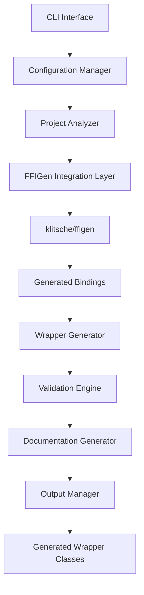

# Design Document

## Overview

The C-to-PHP FFI Converter is a command-line tool that extends klitsche/ffigen to provide a more comprehensive and user-friendly solution for generating PHP FFI wrapper classes from C projects. While klitsche/ffigen generates low-level bindings (constants.php and Methods.php trait), our tool will create complete object-oriented wrapper classes with validation, error handling, and comprehensive documentation.

The tool addresses the limitations of manual FFI wrapper creation by automating the entire process and providing additional safety features that klitsche/ffigen doesn't offer out of the box.

## Architecture

### High-Level Architecture



### Component Architecture

The system follows a layered architecture with clear separation of concerns:

1. **Presentation Layer**: CLI interface for user interaction
2. **Application Layer**: Configuration management and orchestration
3. **Domain Layer**: Core business logic for wrapper generation
4. **Infrastructure Layer**: File I/O, external tool integration

## Components and Interfaces

### 1. CLI Interface (`src/Console/`)

**Purpose**: Provides command-line interface for the tool

**Key Classes**:
- `GenerateCommand`: Main command for generating wrappers
- `ValidateCommand`: Command for validating existing wrappers
- `Application`: Console application entry point

**Interface**:
```php
interface CommandInterface
{
    public function execute(InputInterface $input, OutputInterface $output): int;
}
```

### 2. Configuration Manager (`src/Config/`)

**Purpose**: Manages tool configuration and project settings

**Key Classes**:
- `ConfigLoader`: Loads configuration from files and CLI arguments
- `ProjectConfig`: Represents project-specific configuration
- `GenerationConfig`: Represents generation-specific settings

**Interface**:
```php
interface ConfigInterface
{
    public function getHeaderFiles(): array;
    public function getLibraryFile(): string;
    public function getOutputPath(): string;
    public function getNamespace(): string;
    public function getValidationRules(): array;
}
```

### 3. Project Analyzer (`src/Analyzer/`)

**Purpose**: Analyzes C projects to extract metadata and dependencies

**Key Classes**:
- `HeaderAnalyzer`: Analyzes C header files for dependencies
- `LibraryAnalyzer`: Analyzes shared libraries for symbols
- `DependencyResolver`: Resolves header file dependencies

**Interface**:
```php
interface AnalyzerInterface
{
    public function analyze(string $path): AnalysisResult;
}
```

### 4. FFIGen Integration Layer (`src/Integration/`)

**Purpose**: Integrates with klitsche/ffigen and processes its output

**Key Classes**:
- `FFIGenRunner`: Executes klitsche/ffigen with custom configuration
- `BindingProcessor`: Processes generated bindings from klitsche/ffigen
- `ConfigurationBuilder`: Builds klitsche/ffigen configuration

**Interface**:
```php
interface FFIGenIntegrationInterface
{
    public function generateBindings(ProjectConfig $config): BindingResult;
    public function processBindings(BindingResult $result): ProcessedBindings;
}
```

### 5. Wrapper Generator (`src/Generator/`)

**Purpose**: Generates high-level PHP wrapper classes from processed bindings

**Key Classes**:
- `ClassGenerator`: Generates main wrapper classes
- `MethodGenerator`: Generates wrapper methods with validation
- `PropertyGenerator`: Generates class properties for structs
- `TemplateEngine`: Handles code template processing

**Interface**:
```php
interface GeneratorInterface
{
    public function generate(ProcessedBindings $bindings): GeneratedCode;
}
```

### 6. Validation Engine (`src/Validation/`)

**Purpose**: Provides runtime validation for generated wrapper methods

**Key Classes**:
- `ParameterValidator`: Validates method parameters
- `TypeConverter`: Converts PHP types to C types
- `RangeValidator`: Validates parameter ranges and constraints

**Interface**:
```php
interface ValidatorInterface
{
    public function validate($value, ValidationRule $rule): ValidationResult;
}
```

### 7. Documentation Generator (`src/Documentation/`)

**Purpose**: Generates comprehensive documentation for wrapper classes

**Key Classes**:
- `PHPDocGenerator`: Generates PHPDoc comments
- `ReadmeGenerator`: Generates README files
- `ExampleGenerator`: Generates usage examples

**Interface**:
```php
interface DocumentationGeneratorInterface
{
    public function generateDocumentation(GeneratedCode $code): Documentation;
}
```

## Data Models

### Core Data Models

```php
// Configuration Models
class ProjectConfig
{
    public array $headerFiles;
    public string $libraryFile;
    public string $outputPath;
    public string $namespace;
    public array $excludePatterns;
    public ValidationConfig $validation;
}

class ValidationConfig
{
    public bool $enableParameterValidation;
    public bool $enableTypeConversion;
    public array $customValidationRules;
}

// Analysis Models
class AnalysisResult
{
    public array $functions;
    public array $structures;
    public array $constants;
    public array $dependencies;
}

class FunctionSignature
{
    public string $name;
    public string $returnType;
    public array $parameters;
    public array $documentation;
}

class StructureDefinition
{
    public string $name;
    public array $fields;
    public bool $isUnion;
}

// Generation Models
class GeneratedCode
{
    public array $classes;
    public array $interfaces;
    public array $traits;
    public Documentation $documentation;
}

class WrapperClass
{
    public string $name;
    public string $namespace;
    public array $methods;
    public array $properties;
    public array $constants;
}
```

## Error Handling

### Error Categories

1. **Configuration Errors**: Invalid configuration files, missing required parameters
2. **Analysis Errors**: Header file parsing errors, missing dependencies
3. **Generation Errors**: Template processing errors, file writing errors
4. **Validation Errors**: Runtime parameter validation failures

### Error Handling Strategy

```php
// Custom Exception Hierarchy
abstract class FFIConverterException extends Exception {}

class ConfigurationException extends FFIConverterException {}
class AnalysisException extends FFIConverterException {}
class GenerationException extends FFIConverterException {}
class ValidationException extends FFIConverterException {}

// Error Handler Interface
interface ErrorHandlerInterface
{
    public function handleError(Throwable $error): void;
    public function reportError(string $message, array $context = []): void;
}
```

### Error Recovery

- **Graceful Degradation**: Continue processing other files when one fails
- **Partial Generation**: Generate what's possible when some components fail
- **Detailed Logging**: Provide comprehensive error messages with context
- **Rollback Capability**: Ability to revert partial generations on failure

## Testing Strategy

### Unit Testing

- **Component Isolation**: Test each component independently with mocks
- **Configuration Testing**: Test various configuration scenarios
- **Validation Logic**: Test parameter validation and type conversion
- **Template Processing**: Test code generation templates

### Integration Testing

- **FFIGen Integration**: Test integration with klitsche/ffigen
- **End-to-End Workflows**: Test complete generation workflows
- **File System Operations**: Test file reading/writing operations
- **CLI Interface**: Test command-line interface functionality

### Test Structure

```
tests/
├── Unit/
│   ├── Config/
│   ├── Analyzer/
│   ├── Generator/
│   └── Validation/
├── Integration/
│   ├── FFIGenIntegration/
│   └── EndToEnd/
└── Fixtures/
    ├── headers/
    ├── libraries/
    └── expected_output/
```

### Testing Tools

- **PHPUnit**: Primary testing framework
- **Mockery**: Mocking framework for dependencies
- **VFS Stream**: Virtual file system for file operation testing
- **Docker**: Containerized testing environment with C libraries

## Implementation Approach

### Phase 1: Core Infrastructure
- Set up project structure and dependencies
- Implement configuration management
- Create basic CLI interface
- Integrate with klitsche/ffigen

### Phase 2: Analysis and Generation
- Implement header file analysis
- Create wrapper class generation
- Add basic validation engine
- Generate simple documentation

### Phase 3: Advanced Features
- Add comprehensive parameter validation
- Implement type conversion system
- Create advanced documentation generation
- Add error handling and recovery

### Phase 4: Polish and Optimization
- Optimize performance for large projects
- Add comprehensive test coverage
- Create user documentation and examples
- Package for distribution

## Dependencies

### External Dependencies
- **klitsche/ffigen**: Core FFI binding generation
- **symfony/console**: CLI interface framework
- **symfony/yaml**: Configuration file parsing
- **twig/twig**: Template engine for code generation
- **phpstan/phpdoc-parser**: PHPDoc parsing and generation

### Development Dependencies
- **phpunit/phpunit**: Testing framework
- **mockery/mockery**: Mocking framework
- **mikey179/vfsstream**: Virtual file system for testing
- **phpstan/phpstan**: Static analysis
- **squizlabs/php_codesniffer**: Code style checking